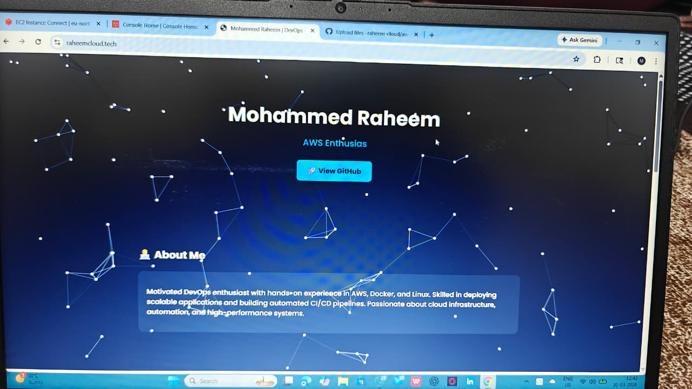
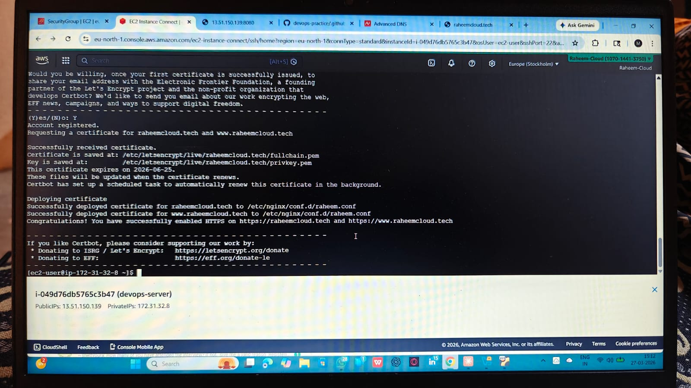
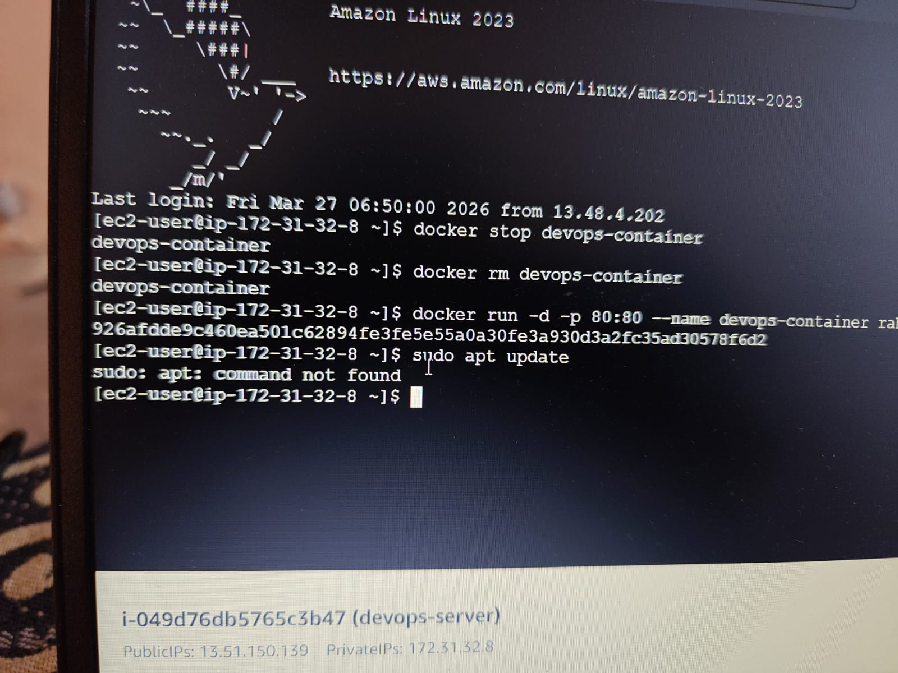

# AWS DevOps Deployment 🚀

## Overview
This project demonstrates deploying a Dockerized application on AWS EC2 with a custom domain and HTTPS.

## Tech Stack
- AWS EC2
- Docker
- Nginx
- Certbot (SSL)

## Features
- Custom domain: raheemcloud.tech
- HTTPS enabled 🔐
- Containerized deployment

## Steps
1. Launch EC2 instance
2. Install Docker
3. Run application container
4. Configure Nginx reverse proxy
5. Enable SSL using Certbot

## Live Demo
👉 https://raheemcloud.tech

## Author
Mohammed Raheem D

## Screenshots

### 🌐 Website

### 🌐 Website

### ☁️ AWS EC2 Setup

### ☁️ AWS EC2 Setup

### 🔧 Nginx Setup

